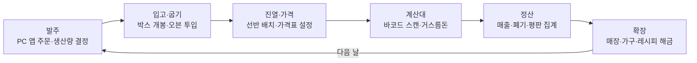

# Bakery Shop Simulator

1인칭 시점에서 재료를 발주하고, 빵을 굽고, 진열하고, 계산대에서 직접 손님을 받으며 가게를 키우는 3D 빵집 운영 시뮬레이터입니다. 레퍼런스는 TCG Card Shop Simulator이며, 카드 팩 개봉의 재미는 **미스터리 재료 박스**와 **레시피 도감**으로 대응합니다.

> 현재 상태: 기획 단계 (2026년 10월). 플레이 영상과 빌드 링크는 MVP 완성 후 추가합니다.

## 한눈에 보기

| 항목 | 내용 |
| --- | --- |
| 장르 | 경영 시뮬레이션 (상점 운영) |
| 엔진 | Unity (C#) |
| 시점 | 1인칭 3D |
| 플랫폼 | PC (Windows), WebGL |
| 개발 기간 | 8주 (MVP 기준) |

## 핵심 게임 루프

## 기술적으로 보여주고 싶은 것

- **상호작용 구조**: `IInteractable` 인터페이스로 오븐·선반·계산대 같은 대상을 추가해도 플레이어 코드는 그대로
- **데이터 드리븐 설계**: 빵·상품·손님·가구를 코드 수정 없이 ScriptableObject 에셋으로 추가
- **상태 패턴 FSM**: 손님 AI와 결제 흐름을 확장 가능한 구조로 설계
- **이벤트 기반 분리**: 판매 이벤트 하나에 정산·HUD·사운드가 서로 모른 채 반응
- **검증 가능한 확률 시스템**: 가중치 확률 테이블, 천장, 분포 시뮬레이션 테스트
- **3D 세이브**: 배치 오브젝트 고유 ID와 버전 필드로 매장 상태 전체를 저장·복원

## 트러블슈팅

개발 중 겪은 문제를 어떻게 발견하고, 원인을 좁히고, 해결을 수치로 검증했는지 기록합니다. 가장 깊게 파고든 사례는 [docs/troubleshooting](docs/troubleshooting/)에 정리합니다.

> 개발 진행에 따라 추가 예정

## 문서

| 문서 | 내용 |
| --- | --- |
| [기획서 (GDD)](docs/GDD.md) | 컨셉, 핵심 루프, 재미 요소, 기능 명세 |
| [아키텍처](docs/ARCHITECTURE.md) | 계층 구조, 이벤트 목록, 폴더 구성 |
| [로드맵](docs/ROADMAP.md) | MVP 범위와 주차별 일정 |
| [설계 결정 기록](docs/decisions/) | 주요 결정의 배경과 이유 (ADR) |
| [트러블슈팅](docs/troubleshooting/) | 기록 방식과 해결 사례 |
