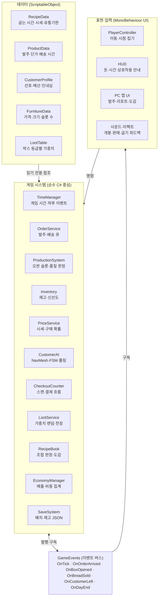

# 아키텍처

데이터·시스템·표현을 분리하고, 그 사이를 이벤트 버스로 잇는다. 시스템은 데이터를 읽기만 하고, 화면은 이벤트를 구독해서만 반응한다.

## 계층 구조



## 설계 원칙

- **데이터 드리븐**: 밸런스 수치와 콘텐츠는 ScriptableObject 에셋에 둔다. 새 빵·상품·손님·가구는 에셋 추가만으로 들어간다.
- **순수 C# 우선**: Inventory, PriceService, LootService, 거스름돈 계산처럼 규칙이 핵심인 코드는 MonoBehaviour에 의존하지 않게 만들어 단위 테스트한다.
- **이벤트로 분리**: UI는 버튼 입력만 시스템에 명령으로 전달하고, 화면 갱신은 이벤트 구독으로만 한다. 예를 들어 빵 하나가 팔리면 `OnBreadSold` 하나에 EconomyManager, HUD, 사운드가 각자 반응한다.
- **시간은 한 곳에서**: 오븐 타이머·신선도·손님 인내심은 모두 TimeManager의 게임 시간을 기준으로 계산한다. 스크립트마다 `Time.deltaTime`을 직접 쓰지 않는다.
- **재현 가능한 랜덤**: 박스 개봉, 손님 생성 등 모든 난수는 시드 고정 RNG를 거친다.

## 주요 이벤트

| 이벤트 | 발행 | 주요 구독자 |
| --- | --- | --- |
| `OnTick` | TimeManager | ProductionSystem, Inventory(신선도), CustomerAI |
| `OnDayStart` / `OnDayEnd` | TimeManager | EconomyManager, SaveSystem, HUD |
| `OnOrderArrived` | OrderService | 배송 박스 스폰, HUD 알림 |
| `OnBoxOpened` | LootService | Inventory, 개봉 연출(FX) |
| `OnRecipeDiscovered` | RecipeBook | 도감 UI, FX |
| `OnBreadSold` | CheckoutCounter | EconomyManager, HUD, FX |
| `OnCustomerLeft` | CustomerAI | EconomyManager(평판), HUD |

## 폴더 구성

```
Assets/
  Scripts/
    Data/        ScriptableObject 정의 (Recipe, Product, Customer, Furniture, LootTable)
    Core/        TimeManager, GameEvents, SaveSystem, Rng
    Player/      PlayerController, IInteractable, HeldItem
    Systems/     Order, Production, Inventory, Price, Customer, Checkout, Loot, RecipeBook, Economy
    UI/          HUD, PC 앱 화면
  Data/          ScriptableObject 에셋 인스턴스
  Tests/
    EditMode/    Inventory, PriceService, LootService 분포, 거스름돈 계산 등 순수 C# 테스트
```
