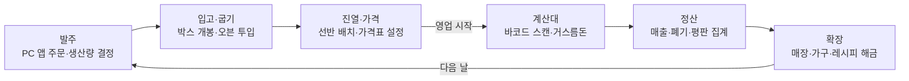

# 기획서 (Game Design Document)

## 1. 개요

TCG Card Shop Simulator처럼 1인칭 시점에서 발주·굽기·진열·계산을 직접 하며 가게를 키우는 3D 빵집 운영 시뮬레이터다. 8주 안에 플레이 가능한 빌드를 완성해 게임사 클라이언트 직군 지원용 포트폴리오로 쓰는 것이 목표다.

| 항목 | 내용 |
| --- | --- |
| 장르 | 경영 시뮬레이션 (상점 운영) |
| 엔진 | Unity (C#) |
| 시점 | 1인칭 3D |
| 플랫폼 | PC, WebGL 빌드 |
| 하루 사이클 | 실시간 5~8분 (영업 준비 → 영업 → 정산) |
| 개발 기간 | 8주, 하루 1~2시간 |
| 레퍼런스 | TCG Card Shop Simulator (OPNeon Games, 2024 얼리 액세스) |

레퍼런스에서 가져올 것은 네 가지다. 직접 박스를 들고 옮겨 진열하는 손맛, PC 앱으로 하는 발주, 플레이어가 정하는 가격, 번 돈으로 매장을 넓히는 성장감이다.

레퍼런스의 중독성은 카드 팩을 직접 뜯는 랜덤성에서 나온다. 빵집에서는 그 자리를 미스터리 재료 박스가 채우고, 레시피 도감이 수집욕을 받친다(3장 참고).

## 2. 핵심 게임 루프

하루는 발주 → 입고·굽기 → 진열·가격 → 계산대 → 정산 → 확장 순으로 돌고, 번 돈이 다음 날을 키운다. 모든 단계를 플레이어가 1인칭으로 직접 처리한다.

영업 중에도 품절된 빵을 추가로 구울 수 있어 굽기·진열·계산이 동시에 돌아간다. 핵심 판단은 두 가지다. 많이 구우면 폐기가 생기고, 가격을 높게 매기면 손님이 사지 않는다.

## 3. 핵심 재미 요소: 미스터리 재료 박스와 레시피 도감

레퍼런스의 카드 팩 개봉 자리는 미스터리 재료 박스가 채우고, 레시피 도감이 수집욕을 받친다. 두 장치는 하나의 흐름으로 이어진다.

1. 발주 앱에서 미스터리 박스 구매
2. 배송된 박스를 직접 들고 와 개봉, 재료가 하나씩 공개됨
3. 확률로 희귀 재료 획득
4. 희귀 재료로 한정 레시피를 실험·발견
5. 도감 등록, 한정 메뉴로 고가 판매

### 3.1 미스터리 재료 박스

- 기능: 박스 등급(일반 / 고급)에 따라 내용물 확률이 다르다. 재료는 일반 / 고급 / 희귀 / 전설 4단계이며, 개봉 시 희귀도에 따라 빛 색과 효과음이 달라진다.
- 구현: `LootTable`(ScriptableObject)에 재료별 가중치를 두고 가중치 랜덤으로 뽑는다. 확률은 전부 데이터에서 조정한다.
- 천장: 일정 횟수 동안 희귀 이상이 안 나오면 다음 개봉에서 보장한다. 카운터는 세이브에 포함한다.
- 난수: 시드 고정 RNG로 같은 세이브에서 같은 결과를 재현할 수 있게 한다.
- 검증: 수만 회 개봉 시뮬레이션으로 실제 분포가 설정 확률과 맞는지 확인하는 단위 테스트를 둔다.

### 3.2 레시피 도감

- 기능: 오븐에 재료 조합을 넣어 실험하고, 맞는 조합이면 새 레시피가 발견되어 도감에 등록되고 메뉴로 해금된다. 미발견 레시피는 실루엣과 짧은 힌트로 보여준다.
- 구현: `RecipeData`에 필요 재료 집합을 둔다. 투입한 재료 ID를 정렬해 키로 만들고, 딕셔너리 조회로 조합을 판정한다.
- 보상: 도감 완성도에 따라 평판 보너스와 새 박스 등급을 해금한다.

### 3.3 경제와의 연결

- 한정 메뉴는 시세가 높고 하루 판매 수량이 제한되어 희소성이 생긴다.
- 희귀 재료는 직접 쓰거나 되팔 수 있다. 레퍼런스의 "레어 카드를 팔까, 소장할까" 선택과 같은 고민을 준다.

## 4. 기능 명세

모든 수치(가격, 굽는 시간, 손님 성향)는 코드가 아니라 데이터 에셋에 둔다. 우선순위 1은 MVP 필수, 2는 MVP 직후에 붙인다.

| 기능 | 핵심 구현 방법 | 우선순위 |
| --- | --- | --- |
| 1인칭 조작·상호작용 | CharacterController + Raycast, IInteractable 인터페이스 | 1 |
| 발주·입고 | 매장 PC의 앱 UI, 배송 박스 스폰·개봉 | 1 |
| 생산(굽기) | RecipeData(ScriptableObject) + 오븐 슬롯, 품질 판정 | 1 |
| 진열·가격 설정 | 선반 슬롯 스냅, 가격표 UI, 시세 대비 구매 확률 | 1 |
| 손님 AI | NavMesh + 상태 패턴 FSM + 오브젝트 풀링 | 1 |
| 계산대 | 바코드 스캔, 현금 거스름돈·카드 결제 | 1 |
| 시간 관리 | TimeManager 게임 시간, 일시정지 | 1 |
| 정산·경제 | EconomyManager, 일일 리포트 | 1 |
| 세이브/로드 | SaveData DTO, 배치 상태까지 JSON 저장 | 1 |
| 미스터리 박스·레시피 도감 | LootTable 가중치 랜덤, 천장, 재료 조합 키 조회 | 1 |
| 매장 확장·가구 배치 | 그리드 배치 모드, 확장 구역 해금 | 2 |
| 수요 변동·통계 | DemandModel 계수 곱, 일자별 그래프 | 2 |

### 4.1 1인칭 조작·상호작용

- 기능: WASD 이동, 마우스 시점, 물건 집기·내려놓기, 박스 들고 옮기기, 선반·오븐·계산대와 상호작용.
- 구현: CharacterController로 이동하고, 화면 중앙 Raycast로 바라보는 대상을 찾는다. 상호작용 가능한 오브젝트는 모두 `IInteractable`(`GetPrompt()`, `Interact(player)`)을 구현해 플레이어 코드가 대상 종류를 몰라도 되게 한다.
- 손에 든 물건은 `HeldItem` 하나로 관리하고, 내려놓을 때 대상에게 받을 수 있는지(`CanAccept`)를 묻는다.
- 이 손맛이 장르의 핵심이므로 1주차에 가장 먼저 만들고 끝까지 다듬는다.

### 4.2 발주·입고

- 기능: 매장 안 PC를 클릭하면 쇼핑 앱 화면이 뜨고, 재료와 포장 상품을 주문하면 잠시 뒤 문 앞에 박스가 도착한다.
- 구현: PC 화면은 화면 전환 UI(또는 World Space Canvas)로 만든다. 주문은 `OrderService`가 큐로 관리하고, 배송 시간이 지나면 `DeliveryBox`를 스폰한다. 박스를 열면 내용물이 창고 재고로 들어간다.
- 데이터: 상품 목록·단가·배송 시간은 `ProductData`(ScriptableObject).

### 4.3 생산(굽기)

- 기능: 재료를 오븐에 넣으면 일정 시간 뒤 완성되고, 꺼내는 타이밍에 따라 품질 등급(덜 익음 / 보통 / 완벽 / 탐)이 정해진다.
- 구현: `RecipeData`에 재료, 굽는 시간, 기준 판매가, 유통기한을 둔다. `Oven`의 슬롯마다 시작 시각을 기억해 진행도와 품질 구간을 계산하고, 진행 바와 색 변화로 타이밍을 보여준다.
- 확장성: 새 빵 추가 = RecipeData 에셋 하나 추가, 코드 수정 없음.

### 4.4 진열·가격 설정

- 기능: 빵을 손으로 선반에 올리고, 선반마다 가격표를 정한다. 신선도는 시간에 따라 떨어진다.
- 구현: 선반은 슬롯 Transform 배열을 가지고, 내려놓으면 가장 가까운 빈 슬롯에 스냅한다. 재고는 순수 C# `Inventory`(단위 테스트 가능), 개별 빵은 `BreadInstance { recipeId, bakedAt, quality }`.
- 가격: 레시피마다 시세(기준가)를 두고, 설정가가 시세보다 높을수록 손님 구매 확률을 낮춘다. 비싸게 조금 팔지, 싸게 많이 팔지를 플레이어가 고른다.

### 4.5 손님 AI

- 기능: 손님이 입장해 선반을 둘러보고 빵을 집어 계산대에 줄을 선다. 원하는 빵이 없거나, 너무 비싸거나, 줄이 길면 떠난다.
- 구현: 이동은 Unity NavMesh(AI Navigation 패키지), 행동은 상태 패턴 FSM(`IState`의 Enter / Tick / Exit)으로 입장 → 탐색 → 집기 → 대기 → 결제 / 이탈.
- 성향: `CustomerProfile`(ScriptableObject)에 선호 빵, 예산, 가격 민감도, 인내심. 인내심이 0이 되면 이탈하고 평판이 떨어진다.
- 성능: 손님은 오브젝트 풀링으로 재사용한다.

### 4.6 계산대

- 기능: 손님이 올린 빵을 하나씩 스캔하면 합계가 뜨고, 현금이면 거스름돈을 직접 꺼내 주고, 카드면 단말기에 금액을 입력한다. 실수하면 손해나 불만이 생긴다.
- 구현: `CheckoutCounter`가 스캔한 품목을 모으고, `PaymentFlow` 상태(스캔 → 결제 방식 → 거스름돈/카드 입력 → 완료)로 진행한다. 거스름돈 검증은 순수 함수로 분리해 테스트한다.
- 확장: 직원 고용 시 같은 `PaymentFlow`를 AI 점원이 자동으로 수행한다.

### 4.7 시간 관리

- 기능: 개점 → 영업 → 마감으로 이어지는 하루, 일시정지.
- 구현: TimeManager가 게임 시간을 관리하고 `OnTick`, `OnDayStart`, `OnDayEnd`를 발행한다. 오븐 타이머·신선도·손님 인내심은 모두 이 시간을 기준으로 계산하고, 스크립트마다 `Time.deltaTime`을 직접 쓰지 않는다.

### 4.8 정산·경제

- 기능: 마감 후 PC의 리포트 앱에서 매출, 재료비, 폐기 손실, 순이익, 평판 변화를 본다.
- 구현: `EconomyManager`가 판매·발주·폐기 이벤트를 구독해 집계하고, 하루 끝에 `DailyReport` 레코드를 만든다.

### 4.9 세이브/로드

- 기능: 마감 후 자동 저장, 이어하기.
- 구현: `SaveData` DTO로 분리해 JSON으로 저장한다. 3D라서 선반·가구의 위치와 회전, 슬롯별 재고까지 저장해야 하므로 배치 오브젝트마다 고유 ID를 부여한다. `saveVersion` 필드로 구조 변경에 대비한다.

### 4.10 매장 확장·가구 배치 (MVP 이후)

- 기능: 돈과 레벨로 확장 구역을 해금하고, 선반·오븐·테이블을 사서 원하는 곳에 놓는다.
- 구현: 바닥 그리드 기반 배치 모드(고스트 미리보기, 충돌 검사, 회전). 배치 후 NavMeshSurface를 런타임에 다시 굽는다. 가구 정보는 `FurnitureData`(ScriptableObject).

### 4.11 수요 변동·통계 (MVP 이후)

- 기능: 요일·날씨·평판에 따라 손님 수와 선호가 바뀌고, 다음 날 예보를 보고 발주량을 정한다. 일자별 매출·폐기·인기 빵을 그래프로 본다.
- 구현: `DemandModel` = 기본 수요 × 요일 계수 × 날씨 계수 × 평판 계수. 난수는 시드를 고정해 같은 세이브에서 같은 결과가 나오게 한다.
